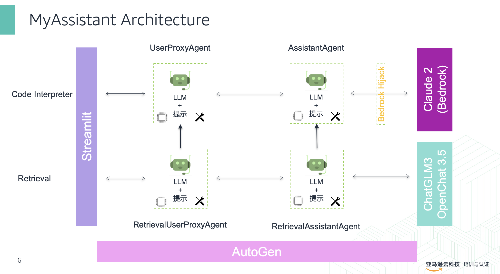
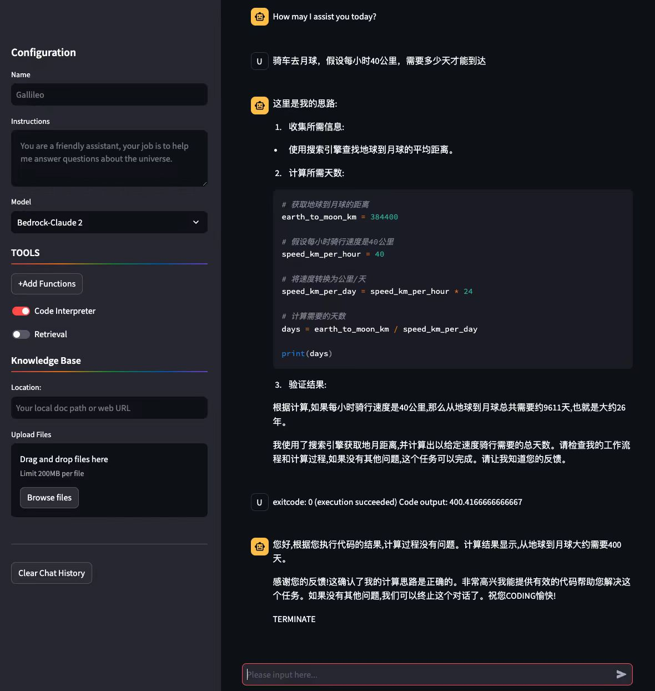
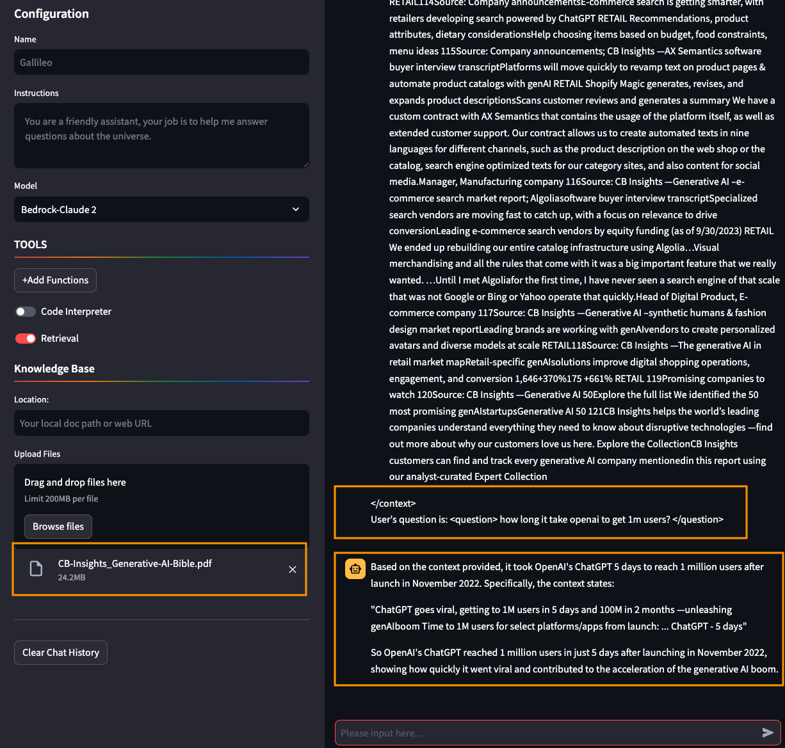
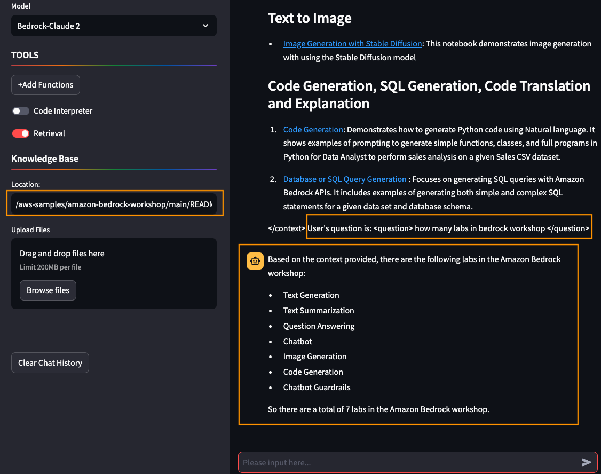
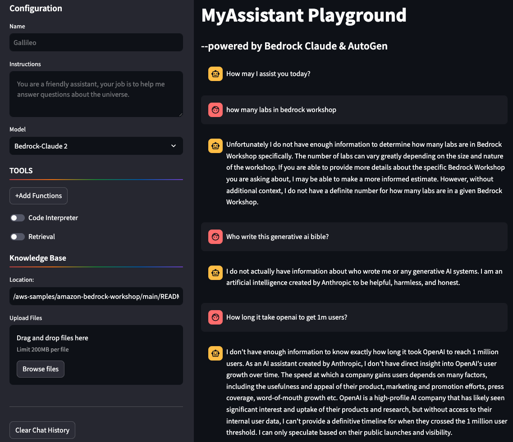

# autogen-bedrock-claude-streamlit
MyAssistant Playground --powered by Bedrock Claude &amp; AutoGen

:fire: AutoGen with Bedrock and Open LLMs [slides](assets/AutoGen%20with%20Bedrock%20and%20Open%20LLMs.pptx)

:fire: Function calling migration: from GPT-4 to Claude 3 [Notes](https://tropical-dresser-bff.notion.site/FC-migrating-from-GPT-4-to-Claude-3-633568b218414632a367295d48d9f400)

# Architecture


# Demo scripts and screenshots
Code Interpreter


Retrieval



Vanilla Chat


## demo scripts
Code Interpreter
- how many days would it take to drive from Earth to the Moon if I were traveling at 60 miles per hour?
- 骑车去月球，假设每小时40公里，需要多少天才能到达?

- 下面这句话有多少字(符)：”Bedrock是AWS新推出的生成式AI服务”
- How many characters in this sentence: "I like Amazon Bedrock, it's super fast and performable"

- 列出我的已停止的ec2实例
- 列出我的s3存储桶

Retrieval
- Who write this generative ai bible? 
- How long it take openai to get 1m users? 
- How many labs in this bedrock workshop?

# Run
Requirements
```
autogen>=0.2.0
streamlit
litellm
openai>=1.1.0
```

Start the API proxy
```
litellm --model bedrock/anthropic.claude-v2
```

Start MyAssistant
```
streamlit run myassistant-autogen.py
```

> [!TIP]
> Please run this MyAssistant demo on EC2 with appropriate permissions

> [!CAUTION]
> Need to configure according environments if you run outside cloud.

# Roadmap
- [x] Code Interpreter
- [x] Retrieval
- [ ] Code Interpreter for Data Scientist
- [x] Function call with Claude
- [ ] Run with open LLMs (OpenHermes-2.5-Mistral-7B, ChatGLM3-6b, OpenChat 3.5)
- [ ] Code execution in Docker

Winston Zhang

2023/11/24
